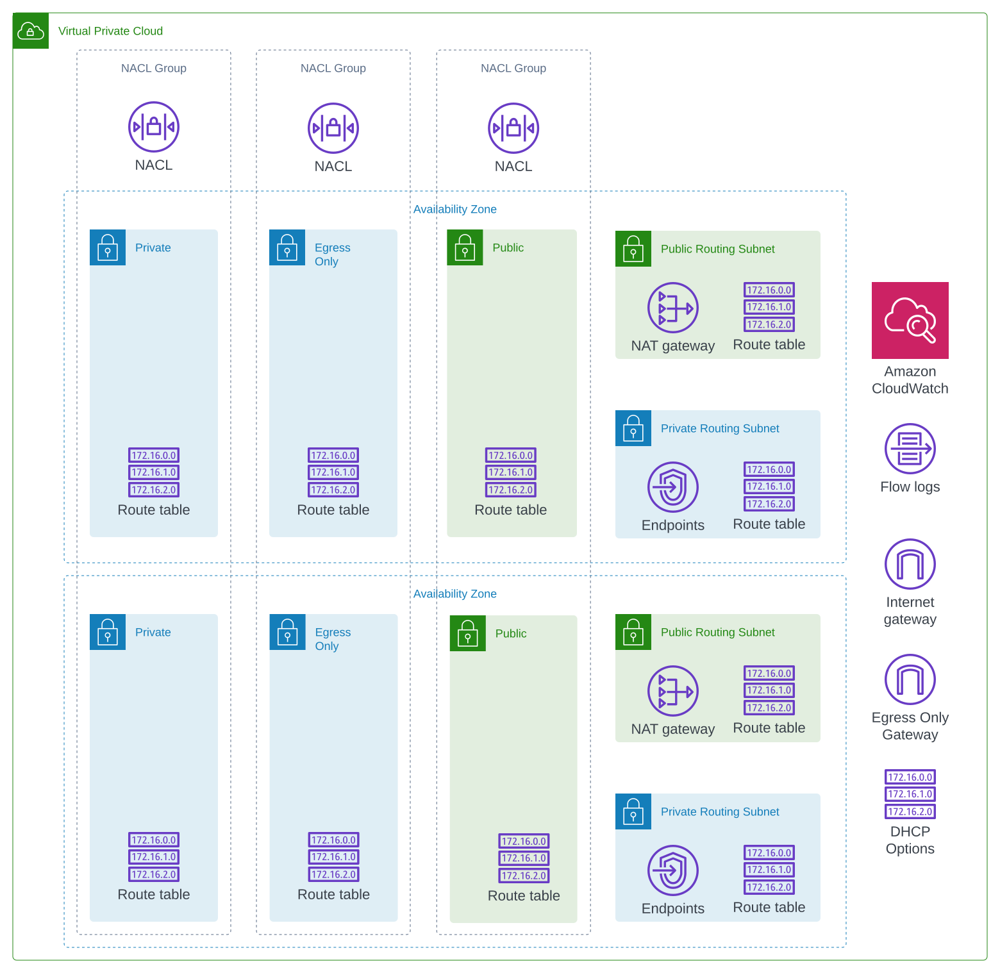
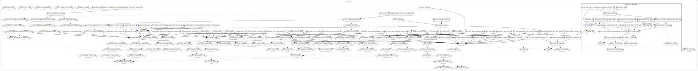

# AWS VPC (work-in-progress)

This Terraform module implements the basic network setup for a VPC in AWS. It gives users fine control over subnets for different purposes and the number of available IPs in each subnet.

It has the following definition:

- **public subnets**: Subnets which assign public ip addresses and have routes to the Internet
- **egress only subnets**: Subnets which do not assign a public _ipv4_ address and have only egress routes to the internet using NAT and Egress-Only gateways.
- **private subnets**: Subnets without ingress or egress routes from the internet.
- **routing subnets**: Special subnets which can be private or public and are used to deploy additional interface endpoints and NAT gateways.

The subnets are defined using a cidr and index tuple, where the _cidr_ value specifies the size of the network (e.g. a `/24` network contains 256 addresses) and the index specifies the starting address **relative to the cidr range of the VPC**. This works for ipv4 as well as ipv6. Note that the _minimum_ network size for ipv4 is `/28` and for ipv6 is `/64`. Because a `/64` network already contains an abundant number of addresses it is not recommended to change this value.

**Subnet Definition Syntax Example:**

```terraform

vpc_cidr = "10.0.0.0"

# first subnet: 10.0.0.0 to 10.0.0.127
private0      = { ipv4 = { cidr = 25, index = 0 } ...

# second subnet: 10.0.0.128 to 10.0.0.255
private1      = { ipv4 = { cidr = 25, index = 1 } ...

# third subnet: 10.0.1.0 to 10.0.0.127
private1      = { ipv4 = { cidr = 25, index = 2 } ...
```

By default it also special routing subnets where Gateways and Interfaces endpoints are deployed. These CIDR range of these subnets is at the end of the available VPC cidr range.

The goal is to make the module flexible but _predictable_ in a way that makes it easy to modify in the long term - e.g. it should be easy to add or remove  a subnet without affecting any unrelated resources.

## Architecture



[AWS Documentation about Dualstack VPCs](https://aws.amazon.com/blogs/networking-and-content-delivery/dual-stack-architectures-for-aws-and-hybrid-networks-part-2/)

## Example

```terraform
module "vpc" {
  source = "github.com/auvaria-internal/terraform-vpc-dualstack"
  
  name = "dataplatform"

  cidr_block_ipv4 = "10.0.0.0/18"
  nat_deployment  = "OnePerAz"

  aws_service_gateway_endpoints         = ["s3", "dynamodb"]
  aws_service_interface_endpoints       = ["lakeformation"]
  aws_service_interface_deployment_type = "OnePerAz"

  subnet_config = {
    #  /-------- Dictionary key names to achieve deterministic behaviour when deploying resources.
    #  |
    #  |                        /----- The cidr tells how large the network should be (a '/24' network)
    #  |                        |
    #  |                        |           /--- The index determines the first ip. E.g. index = 2 on a /24 network is X.X.2.0/24
    #  |                        |           |
    #  V                        v           v
    private0 = { ipv4 = { cidr = 24, index = 0 }, ipv6 = { cidr = 64, index = 0 }, type = "private", availability_zone = "a" },
    private1 = { ipv4 = { cidr = 24, index = 1 }, ipv6 = { cidr = 64, index = 1 }, type = "private", availability_zone = "b" },
    private2 = { ipv4 = { cidr = 24, index = 2 }, ipv6 = { cidr = 64, index = 2 }, type = "private", availability_zone = "c" },
    public0  = { ipv4 = { cidr = 24, index = 11 }, ipv6 = { cidr = 64, index = 11 }, type = "public", availability_zone = "a" },
    public1  = { ipv4 = { cidr = 24, index = 12 }, ipv6 = { cidr = 64, index = 12 }, type = "public", availability_zone = "b" },
    public2  = { ipv4 = { cidr = 24, index = 13 }, ipv6 = { cidr = 64, index = 13 }, type = "public", availability_zone = "c" },
    egress0  = { ipv4 = { cidr = 24, index = 21 }, ipv6 = { cidr = 64, index = 21 }, type = "egress_only", availability_zone = "a" },
    egress1  = { ipv4 = { cidr = 24, index = 22 }, ipv6 = { cidr = 64, index = 22 }, type = "egress_only", availability_zone = "b" },
    egress2  = { ipv4 = { cidr = 24, index = 23 }, ipv6 = { cidr = 64, index = 23 }, type = "egress_only", availability_zone = "c" },
  }

  routing_subnet_config = {
    private0 = { ipv4 = { cidr = 24, index = -1 }, ipv6 = { cidr = 64, index = -1 }, type = "private", availability_zone = "a" },
    private1 = { ipv4 = { cidr = 24, index = -2 }, ipv6 = { cidr = 64, index = -2 }, type = "private", availability_zone = "b" },
    private2 = { ipv4 = { cidr = 24, index = -3 }, ipv6 = { cidr = 64, index = -3 }, type = "private", availability_zone = "c" },
    public0  = { ipv4 = { cidr = 24, index = -4 }, ipv6 = { cidr = 64, index = -4 }, type = "public", availability_zone = "a" },
    public1  = { ipv4 = { cidr = 24, index = -5 }, ipv6 = { cidr = 64, index = -5 }, type = "public", availability_zone = "b" },
    public2  = { ipv4 = { cidr = 24, index = -6 }, ipv6 = { cidr = 64, index = -6 }, type = "public", availability_zone = "c" },
  }

  flow_log_enabled = true
  
  flow_log_config = {
    log_group_name    = "ModernData"
    retention_in_days = 3
    traffic_type      = "ALL"
  }
  
  tags = {
    Stage = "development"
  }

  extra_tags_vpc = {
    Environment = "base"
  }
}
```

<!-- BEGIN_TF_DOCS -->
## Requirements

| Name | Version |
|------|---------|
| <a name="requirement_terraform"></a> [terraform](#requirement\_terraform) | ~> 1.2 |
| <a name="requirement_aws"></a> [aws](#requirement\_aws) | ~> 4.0 |

## Providers

| Name | Version |
|------|---------|
| <a name="provider_aws"></a> [aws](#provider\_aws) | ~> 4.0 |

## Modules

| Name | Source | Version |
|------|--------|---------|
| <a name="module_vpc_flow_logs"></a> [vpc\_flow\_logs](#module\_vpc\_flow\_logs) | ./modules/flow-logs | n/a |

## Resources

| Name | Type |
|------|------|
| [aws_egress_only_internet_gateway.this](https://registry.terraform.io/providers/hashicorp/aws/latest/docs/resources/egress_only_internet_gateway) | resource |
| [aws_eip.this](https://registry.terraform.io/providers/hashicorp/aws/latest/docs/resources/eip) | resource |
| [aws_internet_gateway.this](https://registry.terraform.io/providers/hashicorp/aws/latest/docs/resources/internet_gateway) | resource |
| [aws_nat_gateway.this](https://registry.terraform.io/providers/hashicorp/aws/latest/docs/resources/nat_gateway) | resource |
| [aws_route.egress2nat](https://registry.terraform.io/providers/hashicorp/aws/latest/docs/resources/route) | resource |
| [aws_route.egw6](https://registry.terraform.io/providers/hashicorp/aws/latest/docs/resources/route) | resource |
| [aws_route.igw4](https://registry.terraform.io/providers/hashicorp/aws/latest/docs/resources/route) | resource |
| [aws_route.igw4routing](https://registry.terraform.io/providers/hashicorp/aws/latest/docs/resources/route) | resource |
| [aws_route.igw6](https://registry.terraform.io/providers/hashicorp/aws/latest/docs/resources/route) | resource |
| [aws_route.igw6routing](https://registry.terraform.io/providers/hashicorp/aws/latest/docs/resources/route) | resource |
| [aws_route_table.egress](https://registry.terraform.io/providers/hashicorp/aws/latest/docs/resources/route_table) | resource |
| [aws_route_table.private](https://registry.terraform.io/providers/hashicorp/aws/latest/docs/resources/route_table) | resource |
| [aws_route_table.private_routing](https://registry.terraform.io/providers/hashicorp/aws/latest/docs/resources/route_table) | resource |
| [aws_route_table.public](https://registry.terraform.io/providers/hashicorp/aws/latest/docs/resources/route_table) | resource |
| [aws_route_table.public_routing](https://registry.terraform.io/providers/hashicorp/aws/latest/docs/resources/route_table) | resource |
| [aws_route_table_association.egress](https://registry.terraform.io/providers/hashicorp/aws/latest/docs/resources/route_table_association) | resource |
| [aws_route_table_association.private](https://registry.terraform.io/providers/hashicorp/aws/latest/docs/resources/route_table_association) | resource |
| [aws_route_table_association.private_routing](https://registry.terraform.io/providers/hashicorp/aws/latest/docs/resources/route_table_association) | resource |
| [aws_route_table_association.public](https://registry.terraform.io/providers/hashicorp/aws/latest/docs/resources/route_table_association) | resource |
| [aws_route_table_association.public_routing](https://registry.terraform.io/providers/hashicorp/aws/latest/docs/resources/route_table_association) | resource |
| [aws_subnet.routing](https://registry.terraform.io/providers/hashicorp/aws/latest/docs/resources/subnet) | resource |
| [aws_subnet.this](https://registry.terraform.io/providers/hashicorp/aws/latest/docs/resources/subnet) | resource |
| [aws_vpc.this](https://registry.terraform.io/providers/hashicorp/aws/latest/docs/resources/vpc) | resource |
| [aws_vpc_dhcp_options.this](https://registry.terraform.io/providers/hashicorp/aws/latest/docs/resources/vpc_dhcp_options) | resource |
| [aws_vpc_dhcp_options_association.this](https://registry.terraform.io/providers/hashicorp/aws/latest/docs/resources/vpc_dhcp_options_association) | resource |
| [aws_vpc_endpoint.aws_gateway](https://registry.terraform.io/providers/hashicorp/aws/latest/docs/resources/vpc_endpoint) | resource |
| [aws_vpc_endpoint.aws_interface](https://registry.terraform.io/providers/hashicorp/aws/latest/docs/resources/vpc_endpoint) | resource |
| [aws_availability_zones.azs](https://registry.terraform.io/providers/hashicorp/aws/latest/docs/data-sources/availability_zones) | data source |
| [aws_region.current](https://registry.terraform.io/providers/hashicorp/aws/latest/docs/data-sources/region) | data source |
| [aws_vpc_endpoint_service.aws_gateway](https://registry.terraform.io/providers/hashicorp/aws/latest/docs/data-sources/vpc_endpoint_service) | data source |
| [aws_vpc_endpoint_service.aws_interface](https://registry.terraform.io/providers/hashicorp/aws/latest/docs/data-sources/vpc_endpoint_service) | data source |

## Inputs

| Name | Description | Type | Default | Required |
|------|-------------|------|---------|:--------:|
| <a name="input_aws_service_gateway_endpoints"></a> [aws\_service\_gateway\_endpoints](#input\_aws\_service\_gateway\_endpoints) | AWS services where a Gateway endpoint will be deployed in form of additional entries to the route tables in every subnet. | `set(string)` | <pre>[<br>  "s3",<br>  "dynamodb"<br>]</pre> | no |
| <a name="input_aws_service_interface_deployment_type"></a> [aws\_service\_interface\_deployment\_type](#input\_aws\_service\_interface\_deployment\_type) | How interface endpoints should be deployed. Can be one of None\|Single\|OnePerAz\|EverySubnet. | `string` | `"OnePerAz"` | no |
| <a name="input_aws_service_interface_endpoints"></a> [aws\_service\_interface\_endpoints](#input\_aws\_service\_interface\_endpoints) | AWS service where Interface endpoint will be deployed to the PRIVATE ROUTING subnets. <br>    The deployment style can be configured with `aws_service_interface_deployment_type` variable. | `set(string)` | `[]` | no |
| <a name="input_cidr_block_ipv4"></a> [cidr\_block\_ipv4](#input\_cidr\_block\_ipv4) | IPv4 cidr block to use, must be private address range, e.g. 10.0.0.0/16 | `string` | n/a | yes |
| <a name="input_dhcp_domain_name"></a> [dhcp\_domain\_name](#input\_dhcp\_domain\_name) | An additional internal domain name that is provided via the DHCP server. | `string` | `null` | no |
| <a name="input_extra_tags_nat"></a> [extra\_tags\_nat](#input\_extra\_tags\_nat) | Extra tags to apply to all NATs | `map(string)` | `{}` | no |
| <a name="input_extra_tags_routing_subnets"></a> [extra\_tags\_routing\_subnets](#input\_extra\_tags\_routing\_subnets) | Extra tags to apply to all routing subnets | `map(string)` | `{}` | no |
| <a name="input_extra_tags_routing_tables"></a> [extra\_tags\_routing\_tables](#input\_extra\_tags\_routing\_tables) | Extra tags to apply to all routing tables | `map(string)` | `{}` | no |
| <a name="input_extra_tags_subnets"></a> [extra\_tags\_subnets](#input\_extra\_tags\_subnets) | Extra tags to apply to all subnets | `map(string)` | `{}` | no |
| <a name="input_extra_tags_vpc"></a> [extra\_tags\_vpc](#input\_extra\_tags\_vpc) | Extra tags to apply to the VPC | `map(string)` | `{}` | no |
| <a name="input_flow_log_config"></a> [flow\_log\_config](#input\_flow\_log\_config) | Additional configuration to configure flowlogs to cloudwatch | <pre>object({<br>    log_group_name    = string<br>    retention_in_days = number<br>    traffic_type      = string<br>  })</pre> | <pre>{<br>  "log_group_name": "",<br>  "retention_in_days": 3,<br>  "traffic_type": "ALL"<br>}</pre> | no |
| <a name="input_flow_log_enabled"></a> [flow\_log\_enabled](#input\_flow\_log\_enabled) | If flowlogs should be enabled | `bool` | `false` | no |
| <a name="input_name"></a> [name](#input\_name) | n/a | `string` | n/a | yes |
| <a name="input_nat_deployment"></a> [nat\_deployment](#input\_nat\_deployment) | Option how to deploy the NAT gateways. Could be: None\|Single\|OnePerAz | `string` | `"Single"` | no |
| <a name="input_routing_subnet_config"></a> [routing\_subnet\_config](#input\_routing\_subnet\_config) | value | <pre>map(object({<br>    ipv4              = object({ cidr = number, index = number })<br>    ipv6              = object({ cidr = number, index = number })<br>    type              = string // public, private or egress_only<br>    availability_zone = string<br>  }))</pre> | <pre>{<br>  "routing_private_a": {<br>    "availability_zone": "a",<br>    "ipv4": {<br>      "cidr": 24,<br>      "index": -1<br>    },<br>    "ipv6": {<br>      "cidr": 64,<br>      "index": -1<br>    },<br>    "type": "private"<br>  },<br>  "routing_private_b": {<br>    "availability_zone": "b",<br>    "ipv4": {<br>      "cidr": 24,<br>      "index": -2<br>    },<br>    "ipv6": {<br>      "cidr": 64,<br>      "index": -2<br>    },<br>    "type": "private"<br>  },<br>  "routing_public_a": {<br>    "availability_zone": "a",<br>    "ipv4": {<br>      "cidr": 24,<br>      "index": -3<br>    },<br>    "ipv6": {<br>      "cidr": 64,<br>      "index": -3<br>    },<br>    "type": "public"<br>  },<br>  "routing_public_b": {<br>    "availability_zone": "b",<br>    "ipv4": {<br>      "cidr": 24,<br>      "index": -4<br>    },<br>    "ipv6": {<br>      "cidr": 64,<br>      "index": -4<br>    },<br>    "type": "public"<br>  }<br>}</pre> | no |
| <a name="input_subnet_config"></a> [subnet\_config](#input\_subnet\_config) | Subnet configuration | <pre>map(object({<br>    ipv4              = object({ cidr = number, index = number })<br>    ipv6              = object({ cidr = number, index = number })<br>    type              = string // public, private or egress_only<br>    availability_zone = string<br>  }))</pre> | n/a | yes |
| <a name="input_subnet_private_dns_hostname_type_on_launch"></a> [subnet\_private\_dns\_hostname\_type\_on\_launch](#input\_subnet\_private\_dns\_hostname\_type\_on\_launch) | n/a | `string` | `"resource-name"` | no |
| <a name="input_tags"></a> [tags](#input\_tags) | Tags to apply to all resources | `map(string)` | `{}` | no |

## Outputs

| Name | Description |
|------|-------------|
| <a name="output_dhcp_options_set_arn"></a> [dhcp\_options\_set\_arn](#output\_dhcp\_options\_set\_arn) | n/a |
| <a name="output_dhcp_options_set_id"></a> [dhcp\_options\_set\_id](#output\_dhcp\_options\_set\_id) | n/a |
| <a name="output_egress_only_gateway_id"></a> [egress\_only\_gateway\_id](#output\_egress\_only\_gateway\_id) | The id of the deployed egress only gateway. |
| <a name="output_egress_only_route_table_ids"></a> [egress\_only\_route\_table\_ids](#output\_egress\_only\_route\_table\_ids) | The route table id that is associated with egress only networks. |
| <a name="output_egress_only_subnet_ids"></a> [egress\_only\_subnet\_ids](#output\_egress\_only\_subnet\_ids) | The ids of all the subnets of type `egress_only`, specified as a map with the same keys that has been provided in the `subnet_config` input. |
| <a name="output_endpoint_aws_service_gateway_ids"></a> [endpoint\_aws\_service\_gateway\_ids](#output\_endpoint\_aws\_service\_gateway\_ids) | The ids of the deployed vpc endpoint gateways for AWS Services. |
| <a name="output_endpoint_aws_service_interface_ids"></a> [endpoint\_aws\_service\_interface\_ids](#output\_endpoint\_aws\_service\_interface\_ids) | The ids of the deployed vpc endpoint interfaces for AWS Services. |
| <a name="output_flow_logs"></a> [flow\_logs](#output\_flow\_logs) | n/a |
| <a name="output_internet_gateway_id"></a> [internet\_gateway\_id](#output\_internet\_gateway\_id) | The id of the deployed internet gateway. |
| <a name="output_nat_gateway_ids_per_az"></a> [nat\_gateway\_ids\_per\_az](#output\_nat\_gateway\_ids\_per\_az) | value |
| <a name="output_private_route_table_ids"></a> [private\_route\_table\_ids](#output\_private\_route\_table\_ids) | The route table id that is associated with private networks. |
| <a name="output_private_routing_subnet_ids"></a> [private\_routing\_subnet\_ids](#output\_private\_routing\_subnet\_ids) | n/a |
| <a name="output_private_subnet_ids"></a> [private\_subnet\_ids](#output\_private\_subnet\_ids) | The ids of all the subnets of type `private`, specified as a map with the same keys that has been provided in the `subnet_config` input. |
| <a name="output_public_route_table_ids"></a> [public\_route\_table\_ids](#output\_public\_route\_table\_ids) | The route table id that is associated with public networks. |
| <a name="output_public_routing_subnet_ids"></a> [public\_routing\_subnet\_ids](#output\_public\_routing\_subnet\_ids) | n/a |
| <a name="output_public_subnet_ids"></a> [public\_subnet\_ids](#output\_public\_subnet\_ids) | The ids of all the subnets of type `public`, specified as a map with the same keys that has been provided in the `subnet_config` input. |
| <a name="output_route_table_ids"></a> [route\_table\_ids](#output\_route\_table\_ids) | n/a |
| <a name="output_routing_subnets_route_table_ids"></a> [routing\_subnets\_route\_table\_ids](#output\_routing\_subnets\_route\_table\_ids) | n/a |
| <a name="output_subnet_ids"></a> [subnet\_ids](#output\_subnet\_ids) | The ids of the subnets, specified as a map with the same keys that has been provided in the `subnet_config` input. |
| <a name="output_vpc_cidr_ipv4"></a> [vpc\_cidr\_ipv4](#output\_vpc\_cidr\_ipv4) | The ipv4 cidr block of the VPC |
| <a name="output_vpc_cidr_ipv6"></a> [vpc\_cidr\_ipv6](#output\_vpc\_cidr\_ipv6) | The ipv6 cidr block of the VPC |
| <a name="output_vpc_id"></a> [vpc\_id](#output\_vpc\_id) | The id of the VPC |
<!-- END_TF_DOCS -->

## Graph

